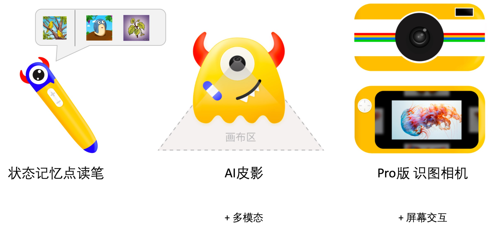

# 鲁宝早教机



这个repo为 鲁宝早教机 的公开展示页面。

完整的鲁宝早教机分为三个级别的硬件，点读笔，多模态读卡器和智能相机


### 完全由AI生成的数据

鲁宝早教机（多模态皮影/读卡器）的想法最早来源于[LIC2024的比赛](https://aistudio.baidu.com/projectdetail/8014418)，在LIC2024中，我们使用了比赛方提供的《十万个为什么》的节选数据。

为了后续增加更多的特征点，在这个repo展示的升级项目中，我们使用**完全由AI生成的替代数据**

<details>
<summary> Example of 生成数据 </summary>

见[链接](https://github.com/LC1332/Lubao-KidLearn/blob/main/datas/example_20_generated.xlsx)。

生成数据由苹果相册对应的4000+词表以及一个扩展词表，由ChatGLM生成对应的科普描述，如

```
什么是乐器呀？	乐器就是能发出好听声音的工具，像小提琴、鼓和笛子。它们能帮助我们演奏美妙的音乐！
中国水仙是什么花？	中国水仙是一种漂亮的花，它可以在水里生长，开花时特别香，是我们中国的传统名花。
```

我们会在8月底之后公开这批完全由AI生成的数据

</details>
