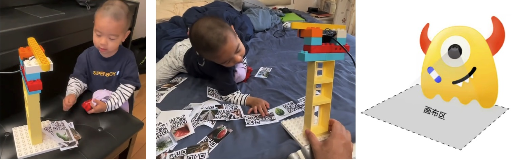
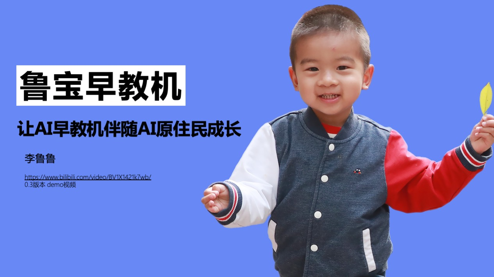
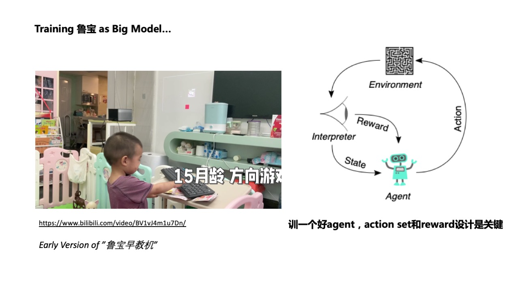
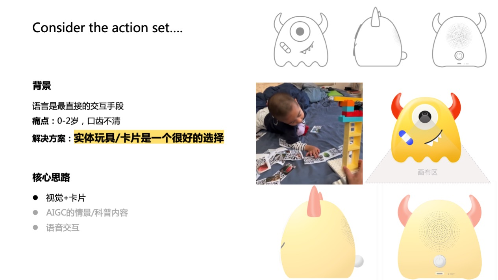

# 鲁宝早教机


这个repo为 鲁宝早教机 的公开展示页面。

完整的鲁宝早教机分为三个级别的硬件，点读笔，多模态读卡器和智能相机


## 鲁宝早教机

本项目是李鲁鲁老师的团队为鲁宝(和二鲁)设计的早教玩具，我们希望探索如何将大模型的能力，以及我们自己的早教理念，融入到一款早教玩具中。
本设计采用了实体卡片作为交互方式，孩子们可以在桌面的指定区域自由放置卡片，并通过摄像头识别卡片实现交互。卡片分为版权卡片和情景卡片，版权卡片是和其他版权方或者我们自己出版的版权内容，而情景卡片则可由家长定制。同时，借助摄像头的入口，我们还支持家长录入家中的玩具，让孩子熟悉的玩具也参与到情景中。孩子们可以通过组合卡片或者玩具来触发科普内容或语言模型生成的情景故事。




每次画布上进入新的卡片，我们会根据卡片组合在数据库中搜索最匹配的科普事件或故事，并通过语音合成输出。我们的数据库包含了版权内容和语言模型生成的情景故事，让孩子们在学习中更加丰富多彩。

我们希望通过鲁宝科普沙盒结合AI技术实现个性化交互，丰富内容，激发孩子们对科学的兴趣，培养他们的逻辑思维。同时，我们设计了多个不同价格级别的硬件，尽可能避免了屏幕使用，保护了孩子们的视力，并且控制了成本，让更多家庭能够享受到这款产品的益处。

我们会制作完整的硬件原型在现场进行展示，希望最终这个项目能够在多方努力下以kickstart之类的形式能够真正生产出来。

当然，在本repo我们也在思考，拍摄仪版本的早教机，是否可以用开源硬件的方式进行发布。即当卡片是二维码版本的时候使用开源硬件，但是商业版使用更精巧的卡片设计。


### 完全由AI生成的数据

鲁宝早教机（多模态皮影/读卡器）的想法最早来源于[LIC2024的比赛](https://aistudio.baidu.com/projectdetail/8014418)，在LIC2024中，我们使用了比赛方提供的《十万个为什么》的节选数据。

为了后续增加更多的特征点，在这个repo展示的升级项目中，我们使用**完全由AI生成的替代数据**

<details>
<summary> Example of 生成数据 </summary>

见[链接](https://github.com/LC1332/Lubao-KidLearn/blob/main/datas/example_20_generated.xlsx)。

生成数据由苹果相册对应的4000+词表以及一个扩展词表，由ChatGLM生成对应的科普描述，如

```
什么是乐器呀？	乐器就是能发出好听声音的工具，像小提琴、鼓和笛子。它们能帮助我们演奏美妙的音乐！
中国水仙是什么花？	中国水仙是一种漂亮的花，它可以在水里生长，开花时特别香，是我们中国的传统名花。
```

我们会在8月底之后公开这批完全由AI生成的数据

</details>

## TODO List

- [ ] 转移演讲稿到readme
- [ ] 建立新的两个比赛的TODO proposal

---

# 演讲稿

演讲稿是完全公开的内容。在本repo中，我们已经移除了LIC2024中《十万个为什么》的内容。如果要查看LIC2024的内容请查看[AI Studio上的链接](https://aistudio.baidu.com/projectdetail/8014418)




认识我的朋友知道我已经有两个儿子，鲁宝和二鲁

## 像强化学习框架一样早教




其实我们AI从业者要是养小孩一定会有一种感觉，就是我们觉得训练儿童在早期，和训练一个智能体是很像的。

所以从鲁宝1岁左右呢，我就开始开发一些早教游戏，比如这个上下左右的游戏。（这里开始播放视频大约30s）

同时呢，我也要感谢大型语言模型的发展，极大程度缩短了我开发这些游戏的时间。



当然我们可以注意到，在儿童比较小的时候，你可以支持的交互方式是非常有限的，他们的吐字还不够清晰，不能被现在的语音识别识别到。相比之下，实体卡片和按键其实是更友好的交互方式。

这就牵引出了我们设计的核心思路，我们希望借助视觉输入的方式，使用卡片和实体玩具作为交互的主要入口。

在这个入口背后呢，可以有海量的科普或者文化的内容，或者是AI生成的一些内容进行播放。

## 三种不同级别的硬件