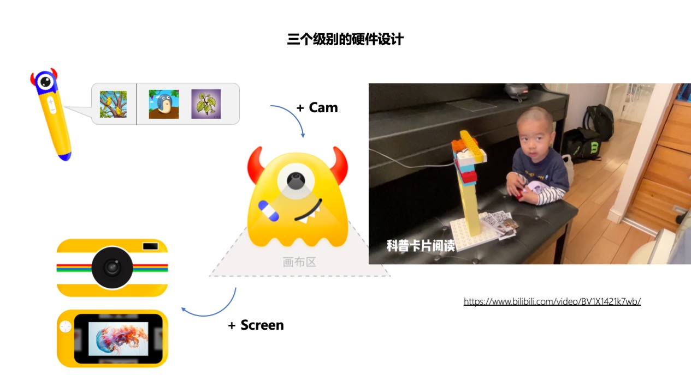
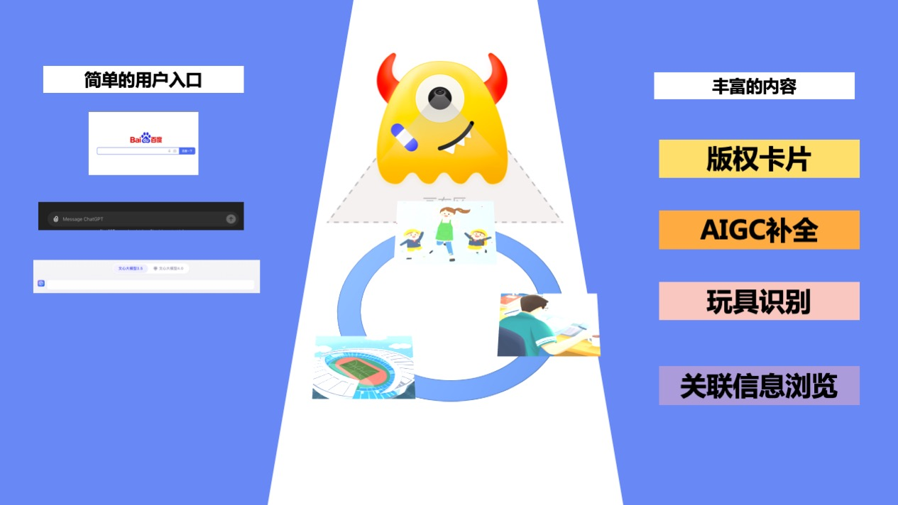
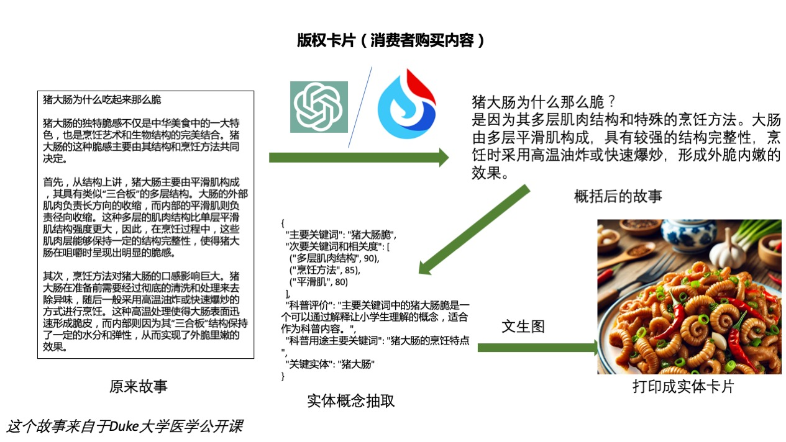
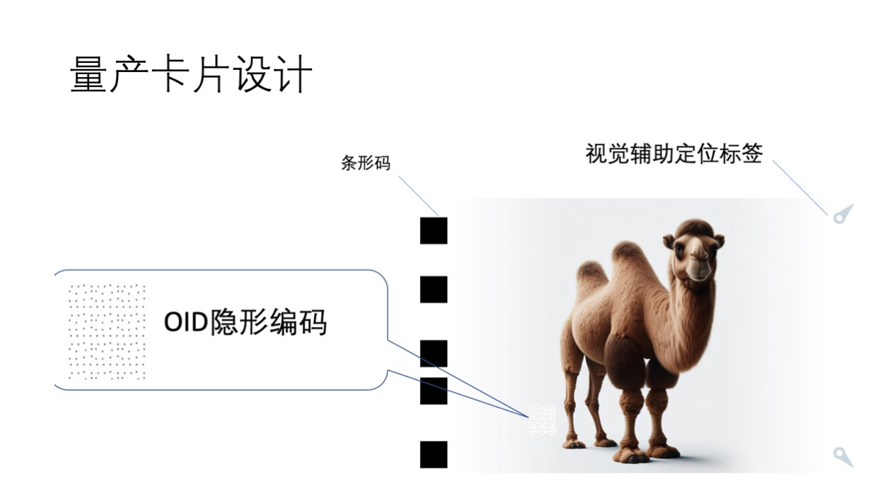
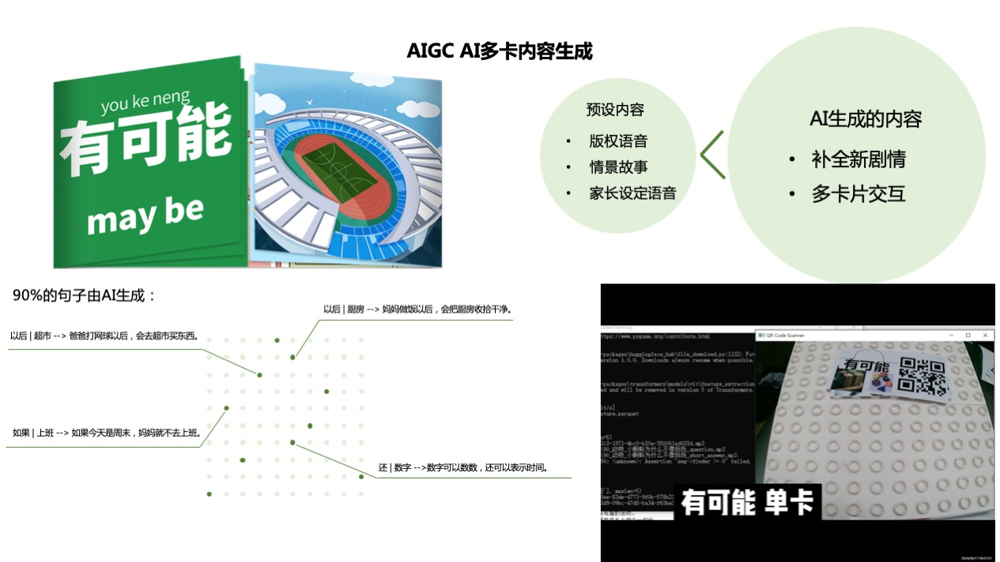
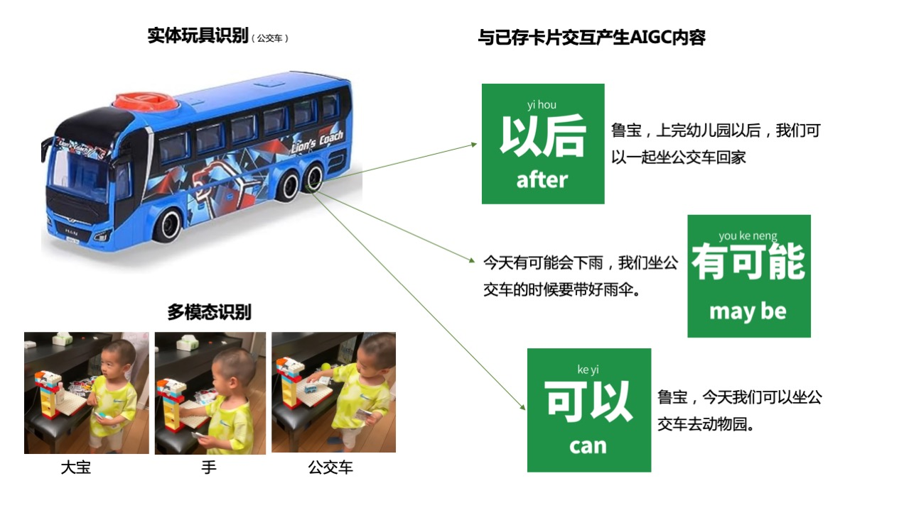
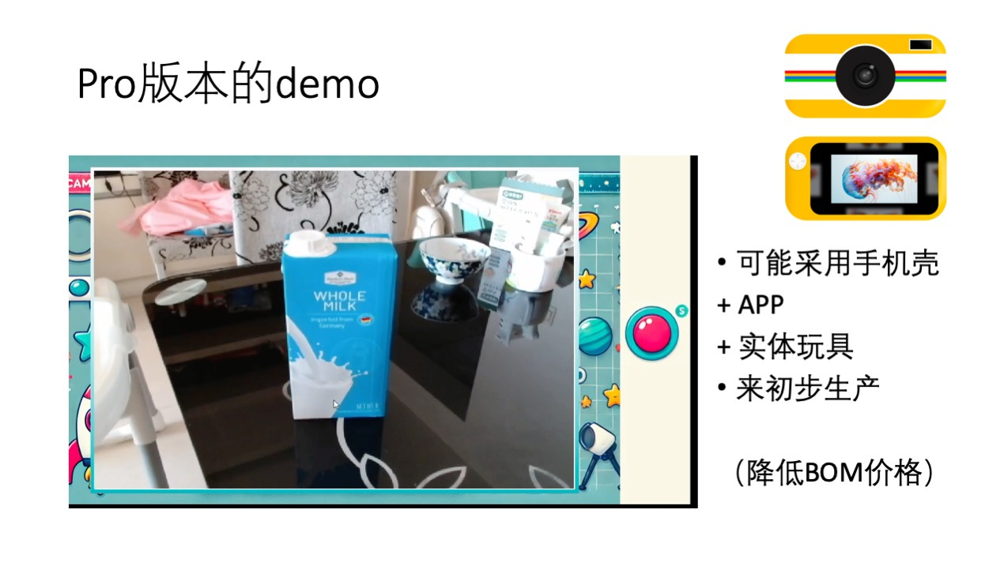
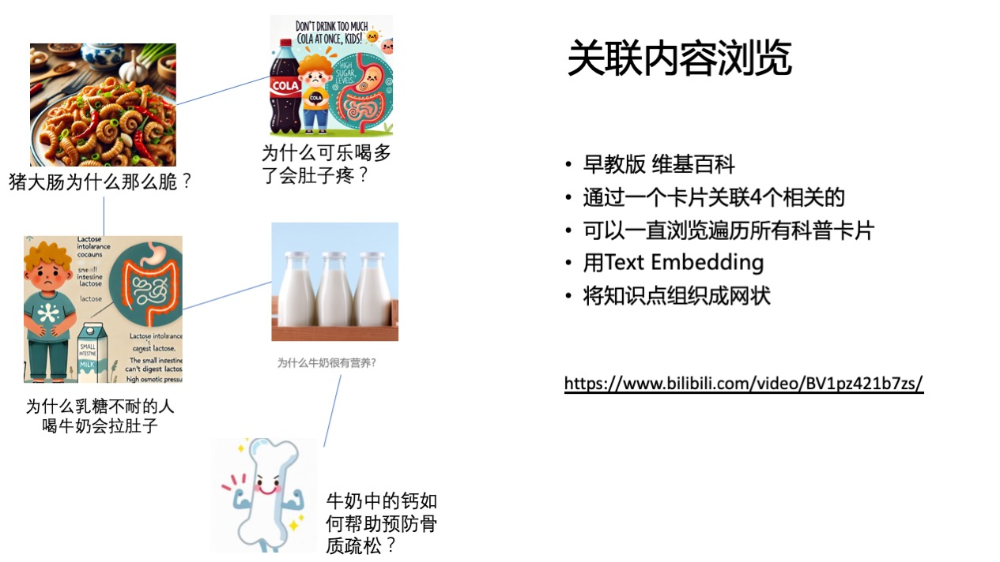
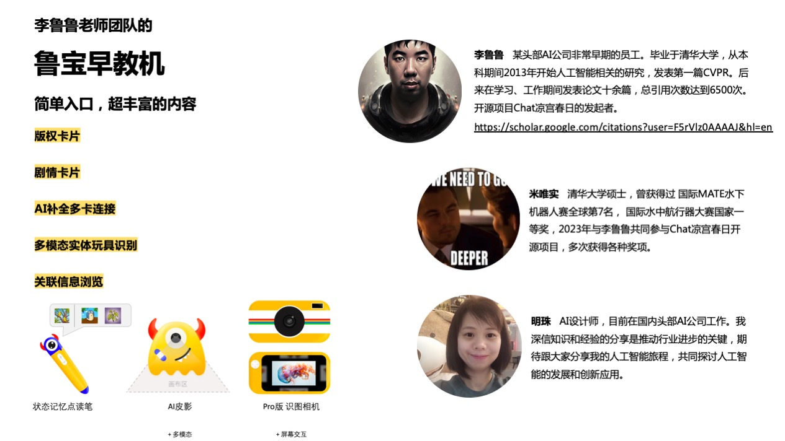

# 鲁宝早教机


这个repo为 鲁宝早教机 的公开展示页面。

完整的鲁宝早教机分为三个级别的硬件，点读笔，多模态读卡器和智能相机


## 鲁宝早教机

本项目是李鲁鲁老师的团队为鲁宝(和二鲁)设计的早教玩具，我们希望探索如何将大模型的能力，以及我们自己的早教理念，融入到一款早教玩具中。
本设计采用了实体卡片作为交互方式，孩子们可以在桌面的指定区域自由放置卡片，并通过摄像头识别卡片实现交互。卡片分为版权卡片和情景卡片，版权卡片是和其他版权方或者我们自己出版的版权内容，而情景卡片则可由家长定制。同时，借助摄像头的入口，我们还支持家长录入家中的玩具，让孩子熟悉的玩具也参与到情景中。孩子们可以通过组合卡片或者玩具来触发科普内容或语言模型生成的情景故事。


每次画布上进入新的卡片，我们会根据卡片组合在数据库中搜索最匹配的科普事件或故事，并通过语音合成输出。我们的数据库包含了版权内容和语言模型生成的情景故事，让孩子们在学习中更加丰富多彩。

我们希望通过鲁宝早教机结合AI技术实现个性化交互，丰富内容，激发孩子们对科学的兴趣，培养他们的逻辑思维。同时，我们设计了多个不同价格级别的硬件，尽可能避免了屏幕使用，保护了孩子们的视力，并且控制了成本，让更多家庭能够享受到这款产品的益处。

我们会制作完整的硬件原型在现场进行展示，希望最终这个项目能够在多方努力下以kickstart之类的形式能够真正生产出来。

当然，在本repo我们也在思考，拍摄仪版本的早教机，是否可以用开源硬件的方式进行发布。即当卡片是二维码版本的时候使用开源硬件，但是商业版使用更精巧的卡片设计。


### 完全由AI生成的数据

鲁宝早教机（多模态皮影/读卡器）的想法最早来源于[LIC2024的比赛](https://aistudio.baidu.com/projectdetail/8014418)，

为了后续增加更多的特征点，在这个repo展示的升级项目中，我们不再使用十万个为什么的数据，而是使用**完全由AI生成的替代数据**

<details>
<summary> Example of 生成数据 </summary>

见[链接](https://github.com/LC1332/Lubao-KidLearn/blob/main/datas/example_20_generated.xlsx)。

生成数据由苹果相册对应的4000+词表以及一个扩展词表，由ChatGLM生成对应的科普描述，如

```
什么是乐器呀？	乐器就是能发出好听声音的工具，像小提琴、鼓和笛子。它们能帮助我们演奏美妙的音乐！
中国水仙是什么花？	中国水仙是一种漂亮的花，它可以在水里生长，开花时特别香，是我们中国的传统名花。
```

我们会在8月底之后公开这批完全由AI生成的数据

</details>

## Outline

- [鲁宝早教机](#鲁宝早教机-1)
  - [完全由AI生成的数据](#完全由ai生成的数据)
- [在不同比赛中计划的增量特征](#在不同比赛中计划的增量特征)
- [演讲稿](#演讲稿)
  - [像强化学习框架一样早教](#像强化学习框架一样早教)
  - [三种不同级别的硬件](#三种不同级别的硬件)
  - [简单的入口逻辑](#简单的入口逻辑)
  - [版权内容卡片](#版权内容卡片)
    - [量产卡片设计](#量产卡片设计)
  - [剧情卡片](#剧情卡片)
  - [和家中的实体玩具进行互动](#和家中的实体玩具进行互动)
  - [Pro版本的多模态互动](#pro版本的多模态互动)
  - [关联内容展示](#关联内容展示)
- [附录-团队](#附录-团队)

---

# 在不同比赛中计划的增量特征

我们计划在不同比赛参赛时，根据比赛的主题，对项目进行一定的加强。这也是我们保证项目持续进展的方式

<details>
<summary> 不同比赛的增量特征 </summary>

## 高通-EIOT

- [ ] 如果入围的话，我们计划将读卡器和Pro版本两个demo移动到高通的开发板上。这样会更接近我们的最终设想
- [ ] 检验包括视觉模型在端上的运行效率，对于产品化也是非常重要的验证过程。

## 讯飞-消费品升级

- [ ] 使用完全AI生成的数据，尝试对接讯飞Spark模型
- [ ] 进一步完善剧情，找一些古典剧情（比如司马光砸缸）进行实验

## 讯飞-绍兴

- [ ] 强化视觉的部分，看看能不能把二维码给简化掉，真正把计划的量产卡片给做了

## 讯飞-星火

- [ ] 米唯实会产生一个分支项目，在鲁宝早教机边上额外接入一个语音音箱。支持更多模态的交互
- [ ] 尝试在一个科普内容之后进行语音追问，或者进行数学教学，
- [ ] 争取在引入语音交互模态之后，更多强调“智能陪伴”的特点

## Gitee

- [ ] 转移项目克隆到Gitee
- [ ] 因为Yi-VL是目前最便宜的视觉大模型，考虑在Pro版本中增加Yi-VL的接入
- [ ] text embedding以及swin-transformer的模型需要改为从gitee载入

## Gemini

- [ ] 增加一个跨模态的记忆相册，增加Pro版本和拍摄仪版本之间的联动。
- [ ] 调整故事，减少东亚卷王属性，着重描写家庭

</details>

 ## TODO List

- [x] 转移演讲稿到readme
- [x] 建立新的两个比赛的TODO proposal
- [ ] 补充插入B站视频
- [ ] 补充Pro版本的多模态互动的文本
- [ ] 做一个目录

---

# 演讲稿

演讲稿是完全公开的内容。在本repo中，我们已经移除了LIC2024中《十万个为什么》的内容。如果要查看LIC2024的内容请查看[AI Studio上的链接](https://aistudio.baidu.com/projectdetail/8014418)


认识我的朋友知道我已经有两个儿子，鲁宝和二鲁

## 像强化学习框架一样早教


其实我们AI从业者要是养小孩一定会有一种感觉，就是我们觉得训练儿童在早期，和训练一个智能体是很像的。

所以从鲁宝1岁左右呢，我就开始开发一些早教游戏，比如这个上下左右的游戏。（这里开始播放视频大约30s）

同时呢，我也要感谢大型语言模型的发展，极大程度缩短了我开发这些游戏的时间。


当然我们可以注意到，在儿童比较小的时候，你可以支持的交互方式是非常有限的，他们的吐字还不够清晰，不能被现在的语音识别识别到。相比之下，实体卡片和按键其实是更友好的交互方式。

这就牵引出了我们设计的核心思路，我们希望借助视觉输入的方式，使用卡片和实体玩具作为交互的主要入口。

在这个入口背后呢，可以有海量的科普或者文化的内容，或者是AI生成的一些内容进行播放。

## 三种不同级别的硬件



在这个核心思想下，我们一共设计了三个不同价位的硬件。一个带状态记忆的点读笔，一个带摄像头的拍摄仪，以及一个同时带摄像头和屏幕的照相机。

【这里播放 剪辑后的视频 包括 科普卡片识别  家长自定义卡片 和 实体玩具互动】 [https://www.bilibili.com/video/BV1X1421k7wb/](https://www.bilibili.com/video/BV1X1421k7wb/)


## 简单的入口逻辑



可以看到 ，我们方案的入口是很简单的，只是一个摄像机，儿童通过在摄像机前面放一些卡片或者物体进行交互。

这和搜索引擎有一点相像。我们希望最终的产品的入口逻辑是简单的，而在简单的入口之下，用户可以接触到的内容是非常丰富的。


## 版权内容卡片




版权内容关联的卡片是整个产品的主要商业模式部分。在这里我们可以结合不同内容的版权方，比如一些科普版权方比如科技馆，或者语言和素质教育的版权方比如培生教育，去和他们联合进行卡片套件的出版。同时，早教机自己的生产者也会成为出版方，推出很多自己的更适合AI生成的早教内容设计。

### 量产卡片设计



这里简单说明下，在原型视频里为了快速开发，我们用的是二维码的卡片。实际如果量产的话，我打算使用边缘条形码加视觉辅助定位标签的设计。另外在卡面上会覆盖OID的红外隐形编码，方便点读笔进行同步的读取。

## 剧情卡片




我们另一个核心的设计是剧情卡片，在这里我们考虑到多张卡片的交互。因为卡片的组合是几何级数增长的，传统的早教机不可能为每种组合都设计台词。而在语言模型的帮助下，我们可以补全每种组合下的信息，产生很多有创意的句子供给孩子学习.

这里我们展示了一套造句卡片的例子，有A卡片（10种不同的关联词）和B卡片（10种不同的场景），其中超过90%的句子是AI自动生成的。可以看到在新的技术引入之后，版权卡片的形式也会发生新的变化。

[https://www.bilibili.com/video/BV1Xf421B7yu/](https://www.bilibili.com/video/BV1Xf421B7yu/)

我们另一种核心的卡片是剧情卡片。剧情卡片会人工设计一条原有的路径，如果按照这条预定的顺序来播放卡片，那就会一次播报原来的剧情设计。
但是显然，儿童不会完全按照原有的顺序来展示卡片。这个时候，就会由AI来参考原剧情，补全出新的剧情。甚至儿童可以在原来剧情的分支中间，插入其他故事的角色，来产生多样化的故事。

## 和家中的实体玩具进行互动

我发现在很多时候，鲁宝都会将玩具的故事和现实的生活进行一定的关联。所以当用户家中有一些实体玩具的时候，可以早教机上对这些玩具进行注册，之后机器就会识别这些玩具和播放对应的内容了。同时，实体玩具的概念也会与现存的卡片产生联动交互，组合出新的句子。



所以我们支持家长定义一些自己的卡片。这些卡片可以是家中的物体，也可以是我们希望儿童学习的一些新概念

[https://www.bilibili.com/video/BV1bw4m1q7Hj/](https://www.bilibili.com/video/BV1bw4m1q7Hj/)

同时，这些新的概念也会与其他卡片发生联动。
更进一步的话，我们可以使用硬件中的摄像头获取画面，进行图像识别。这样我们就可以与家中的实体玩具进行互动

[https://www.bilibili.com/video/BV1Kn4y1975f/](https://www.bilibili.com/video/BV1Kn4y1975f/)

## Pro版本的多模态互动



对于我们正在开发的pro版本，相当于是鲁宝早教机的移动版。我们实际的设想场景是做完Pro版本后，可以在带儿童出去游玩的一些场景，比如户外、水族馆、动物园等地方，留下一些照片和记忆，这些照片和记忆，又可以重新被制作成卡片。加强每一次儿童外出时学习到的记忆。

## 关联内容展示



除了以卡片为入口外，我们也可以一次显示4个最相关的科普内容，供儿童进行选择。这样儿童不停地点击相关内容，就可以实现类似早教版wiki百科的浏览效果。这里由于我们的原型并没有外接触屏，所以我额外实现了一个demo游戏，来实验这个功能点。

[https://www.bilibili.com/video/BV1pz421b7zs/](https://www.bilibili.com/video/BV1pz421b7zs/)

因为是参加比赛所以我们使用了一个相对新颖的交互方式，即摄像头和实体交互的方式。实际上我们设计了三种不同层次的硬件。我们的前两个核心内容 可以简单通过一个带有状态记忆的点读笔来进行实现。 当然加入摄像头后形成的基础版，就可以支持实体玩具等多模态的识别。Pro版本更是可以带出去当作一个智能照相机来进行使用。

## 附录-团队


