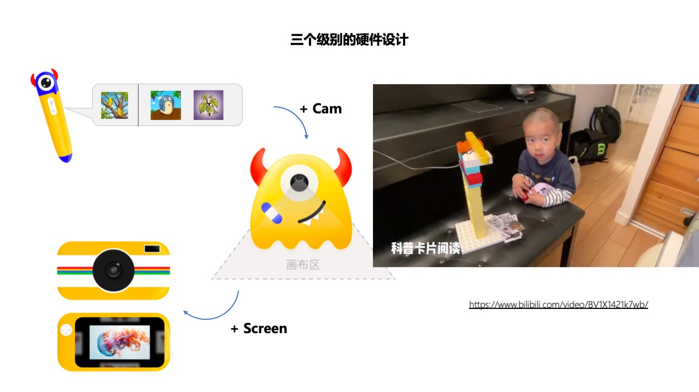
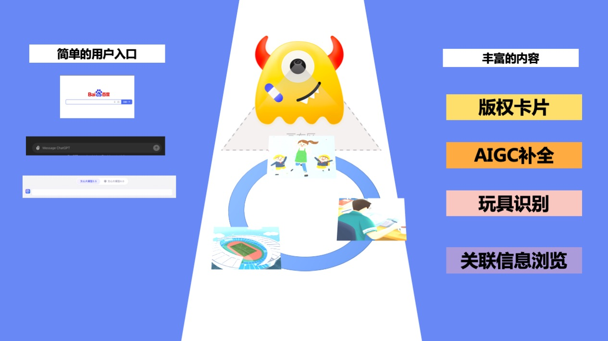
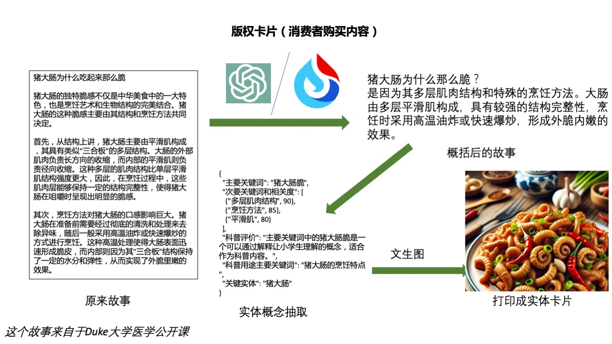
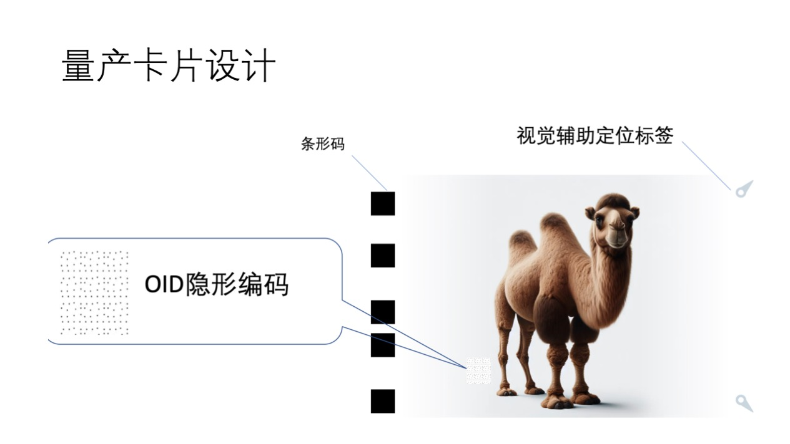
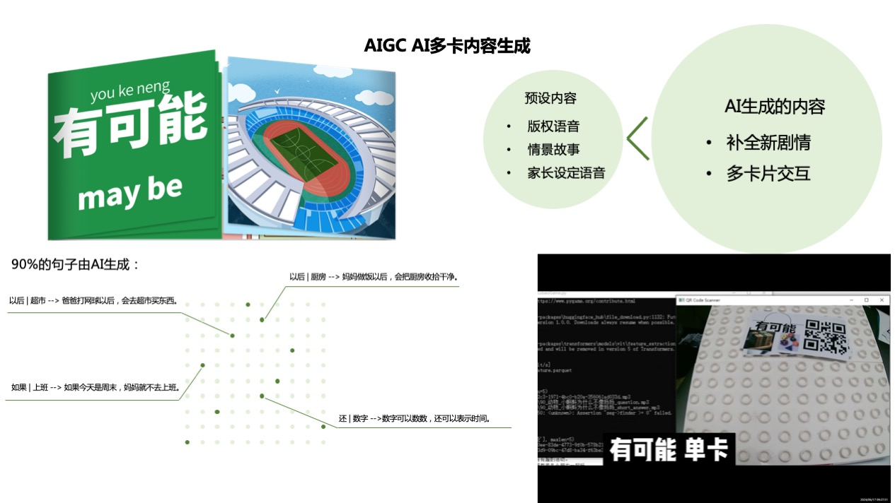
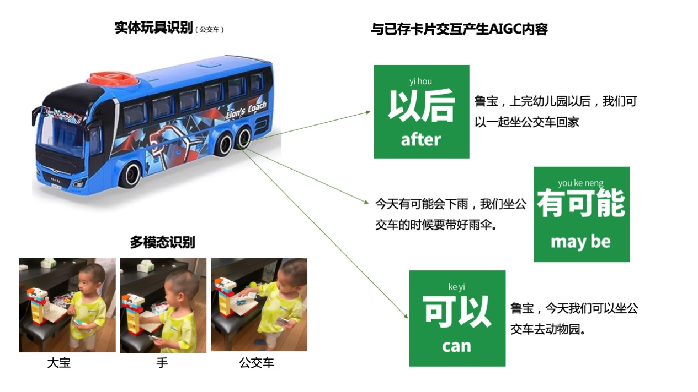
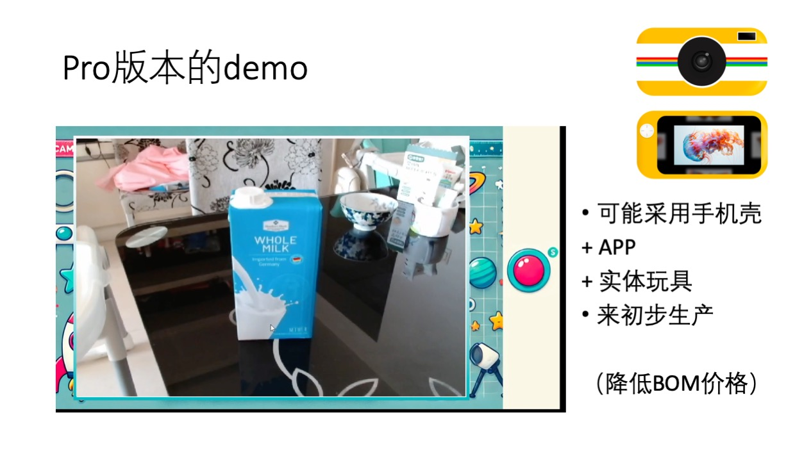
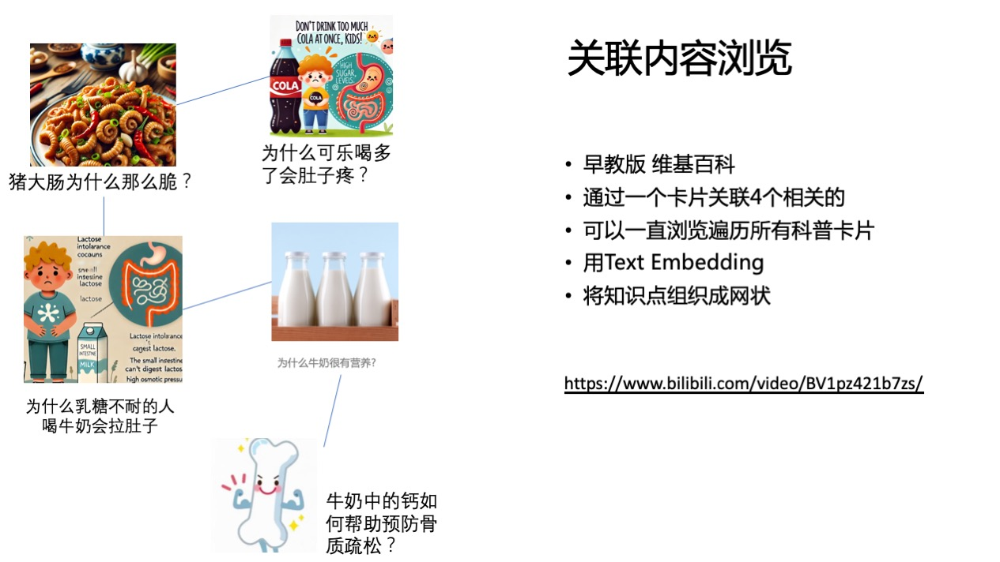
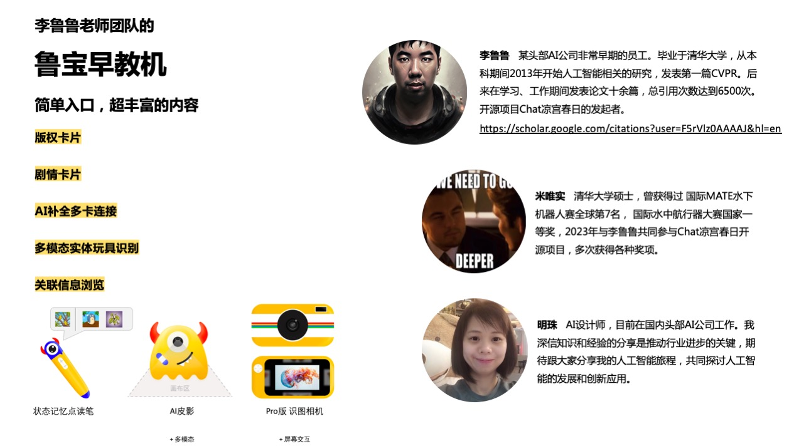

# 演讲稿

项目主页 [https://github.com/LC1332/Lubao-KidLearn](https://github.com/LC1332/Lubao-KidLearn)

演讲稿是完全公开的内容。在本repo中，我们已经移除了LIC2024中《十万个为什么》的内容。如果要查看LIC2024的内容请查看[AI Studio上的链接](https://aistudio.baidu.com/projectdetail/8014418)

## Outline

- [像强化学习框架一样早教](#像强化学习框架一样早教)
- [三种不同级别的硬件](#三种不同级别的硬件)
- [简单的入口逻辑](#简单的入口逻辑)
- [版权内容卡片](#版权内容卡片)
- [量产卡片设计](#量产卡片设计)
- [剧情卡片](#剧情卡片)
- [和家中的实体玩具进行互动](#和家中的实体玩具进行互动)
- [Pro版本的多模态互动](#pro版本的多模态互动)
- [关联内容展示](#关联内容展示)
- [附录-团队](#附录-团队)

认识我的朋友知道我已经有两个儿子，鲁宝和二鲁

## 像强化学习框架一样早教

其实我们AI从业者要是养小孩一定会有一种感觉，就是我们觉得训练儿童在早期，和训练一个智能体是很像的。

所以从鲁宝1岁左右呢，我就开始开发一些早教游戏，比如这个上下左右的游戏。（这里开始播放视频大约30s）

同时呢，我也要感谢大型语言模型的发展，极大程度缩短了我开发这些游戏的时间。

当然我们可以注意到，在儿童比较小的时候，你可以支持的交互方式是非常有限的，他们的吐字还不够清晰，不能被现在的语音识别识别到。相比之下，实体卡片和按键其实是更友好的交互方式。

这就牵引出了我们设计的核心思路，我们希望借助视觉输入的方式，使用卡片和实体玩具作为交互的主要入口。

在这个入口背后呢，可以有海量的科普或者文化的内容，或者是AI生成的一些内容进行播放。

## 三种不同级别的硬件

在这个核心思想下，我们一共设计了三个不同价位的硬件。一个带状态记忆的点读笔，一个带摄像头的拍摄仪，以及一个同时带摄像头和屏幕的照相机。

【这里播放 剪辑后的视频 包括 科普卡片识别  家长自定义卡片 和 实体玩具互动】

## 简单的入口逻辑

可以看到 ，我们方案的入口是很简单的，只是一个摄像机，儿童通过在摄像机前面放一些卡片或者物体进行交互。

这和搜索引擎有一点相像。我们希望最终的产品的入口逻辑是简单的，而在简单的入口之下，用户可以接触到的内容是非常丰富的。

## 版权内容卡片

版权内容关联的卡片是整个产品的主要商业模式部分。在这里我们可以结合不同内容的版权方，比如一些科普版权方比如科技馆，或者语言和素质教育的版权方比如培生教育，去和他们联合进行卡片套件的出版。同时，早教机自己的生产者也会成为出版方，推出很多自己的更适合AI生成的早教内容设计。

### 量产卡片设计

这里简单说明下，在原型视频里为了快速开发，我们用的是二维码的卡片。实际如果量产的话，我打算使用边缘条形码加视觉辅助定位标签的设计。另外在卡面上会覆盖OID的红外隐形编码，方便点读笔进行同步的读取。

## 剧情卡片

我们另一个核心的设计是剧情卡片，在这里我们考虑到多张卡片的交互。因为卡片的组合是几何级数增长的，传统的早教机不可能为每种组合都设计台词。而在语言模型的帮助下，我们可以补全每种组合下的信息，产生很多有创意的句子供给孩子学习.

这里我们展示了一套造句卡片的例子，有A卡片（10种不同的关联词）和B卡片（10种不同的场景），其中超过90%的句子是AI自动生成的。可以看到在新的技术引入之后，版权卡片的形式也会发生新的变化。

我们另一种核心的卡片是剧情卡片。剧情卡片会人工设计一条原有的路径，如果按照这条预定的顺序来播放卡片，那就会一次播报原来的剧情设计。
但是显然，儿童不会完全按照原有的顺序来展示卡片。这个时候，就会由AI来参考原剧情，补全出新的剧情。甚至儿童可以在原来剧情的分支中间，插入其他故事的角色，来产生多样化的故事。

## 和家中的实体玩具进行互动

我发现在很多时候，鲁宝都会将玩具的故事和现实的生活进行一定的关联。所以当用户家中有一些实体玩具的时候，可以早教机上对这些玩具进行注册，之后机器就会识别这些玩具和播放对应的内容了。同时，实体玩具的概念也会与现存的卡片产生联动交互，组合出新的句子。

所以我们支持家长定义一些自己的卡片。这些卡片可以是家中的物体，也可以是我们希望儿童学习的一些新概念

【插入B站视频】

同时，这些新的概念也会与其他卡片发生联动。
更进一步的话，我们可以使用硬件中的摄像头获取画面，进行图像识别。这样我们就可以与家中的实体玩具进行互动

【插入B站视频】

## Pro版本的多模态互动

## 关联内容展示

除了以卡片为入口外，我们也可以一次显示4个最相关的科普内容，供儿童进行选择。这样儿童不停地点击相关内容，就可以实现类似早教版wiki百科的浏览效果。这里由于我们的原型并没有外接触屏，所以我额外实现了一个demo游戏，来实验这个功能点。

【鲁宝早教探究0.3 增加关联卡片游戏】 

因为是参加比赛所以我们使用了一个相对新颖的交互方式，即摄像头和实体交互的方式。实际上我们设计了三种不同层次的硬件。我们的前两个核心内容 可以简单通过一个带有状态记忆的点读笔来进行实现。 当然加入摄像头后形成的基础版，就可以支持实体玩具等多模态的识别。Pro版本更是可以带出去当作一个智能照相机来进行使用。

## 附录-团队

